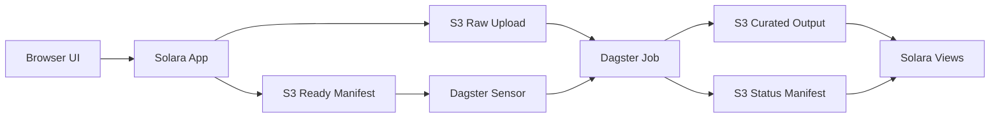

# PRD 09: User Upload Ingestion

## Overview

This PRD defines the simplest robust way to let users upload their own data from the Solara app, land it in S3, process it with Dagster, and make the resulting dataset available in the app.

This architecture assumes there is no separate backend service. The Solara app is the only application tier. It owns upload orchestration, while S3 provides storage plus lightweight control records, and Dagster owns validation and downstream processing.

This document is a generic architectural guide. The control flow is the recommendation, but the exact Dagster asset graph, op boundaries, resources, YAML config shape, bucket names, and Solara wiring should follow the team's existing implementation conventions.

See also [PRD 05](05-architecture-and-tech-stack.md).

---

## Goal

Provide a safe straight-through flow for user-supplied CSV and Excel files:

`Browser -> Solara app -> S3 raw upload -> S3 ready manifest -> Dagster -> curated output + status -> Solara`

The design must be:

- simple to implement
- safe for asynchronous processing
- easy to audit and reprocess
- scalable enough for normal internal usage
- explicit about provenance: official, user-uploaded, or blended

---

## Architecture Decision

### Default implementation

Use Solara-mediated upload for v1:

`Browser -> Solara app -> S3 -> Dagster`

Why:

- simplest control flow in a no-backend architecture
- easy to reason about success and failure
- no separate API service or metadata database required
- compatible with a manifest-driven Dagster trigger

### Optional upgrade

If uploads become large enough that Solara becomes a bottleneck, keep the same control model but switch the file transfer path to:

`Browser -> direct S3 upload using Solara-issued presigned or multipart instructions`

This is an optimization, not the default recommendation.

---

## End-to-End Flow



1. User selects a CSV or Excel file in Solara.
2. Solara validates lightweight metadata: filename, extension, size, tenant/user context, optional schema hint.
3. Solara generates an `upload_id`.
4. Solara streams the raw file to S3.
5. Only after the upload succeeds, Solara writes a ready manifest to a dedicated control prefix.
6. Dagster sensor polls the ready-manifest prefix and launches a run with `run_key=upload_id`.
7. Dagster validates, parses, normalizes, and publishes curated outputs.
8. Dagster writes status and validation results to S3.
9. Solara reads status and curated output references and shows the dataset in the UI with provenance labeling.

---

## User Stories

1. As a user, I want to upload my own dataset from Solara so I can work with data that is not yet in the canonical pipeline.
2. As a user, I want to see whether my upload is uploaded, processing, completed, or failed so I know what happened.
3. As a user, I want to know whether I am viewing official data, my uploaded data, or a blended result so I can trust what I see.
4. As a developer or operator, I want every upload to have a stable ID and auditable status so I can debug, rerun, and support it.

---

## Functional Requirements

### FR-01: Upload Entry In Solara

- Solara must provide a file upload UI for CSV and Excel files.
- Solara must generate a unique `upload_id` before writing control records.
- Solara must reject unsupported file types and files above a configured size limit.
- The browser must not receive long-lived AWS credentials.

### FR-02: S3 Storage Layout

- Raw uploads must be stored separately from system-ingested data.
- Control records must be stored separately from raw files.
- Curated outputs must be stored separately from both raw files and control records.

Recommended layout:

```text
s3://bucket/raw/system_ingest/...
s3://bucket/raw/user_uploads/{tenant_id}/{user_id}/{upload_id}/source.ext
s3://bucket/control/user_uploads/ready/{upload_id}.json
s3://bucket/control/user_uploads/status/{upload_id}.json
s3://bucket/curated/user_uploads/{tenant_id}/{upload_id}/...
```

### FR-03: Ready Manifest Contract

- Solara must create the ready manifest only after the raw file upload completes successfully.
- The ready manifest is the trigger boundary for Dagster.
- Dagster must ignore raw file appearance unless a matching ready manifest exists.

Minimum fields:

```json
{
  "manifest_version": 1,
  "upload_id": "upl_123",
  "tenant_id": "tenant_a",
  "user_id": "user_b",
  "original_filename": "issuance.csv",
  "object_key": "raw/user_uploads/tenant_a/user_b/upl_123/source.csv",
  "file_size": 187654321,
  "content_type": "text/csv",
  "schema_hint": "issuance_records",
  "status": "ready_for_processing",
  "uploaded_at": "2026-03-22T12:00:00Z"
}
```

### FR-04: Dagster Triggering

- Dagster must use a generic `@sensor` to poll the ready-manifest prefix.
- The sensor must poll only the narrow control prefix, not scan the whole raw bucket.
- Each run must use `run_key=upload_id` for idempotency.
- The sensor must pass the manifest location or `upload_id` into the processing job.

### FR-05: Dagster Processing

- Dagster owns schema validation, file parsing, normalization, enrichment, deduplication, and curated publish.
- Dagster must write validation outcomes and processing status back to S3.
- Dagster must preserve the raw upload unchanged.
- Dagster must write a stable reference to the curated output so Solara can load it.

### FR-06: Status Model

The state model should stay small:

- `initiated`
- `uploaded`
- `ready_for_processing`
- `processing`
- `completed`
- `failed`

Example status manifest:

```json
{
  "manifest_version": 1,
  "upload_id": "upl_123",
  "status": "processing",
  "dagster_run_id": "dagster_run_456",
  "validation_errors": [],
  "curated_object_prefix": null,
  "updated_at": "2026-03-22T12:05:00Z"
}
```

### FR-07: Solara UX

- Solara must show selected filename, size, and upload progress.
- Solara must show processing status using the status manifest.
- Solara must show a meaningful failure reason when available.
- Solara must label datasets and downstream views as `official`, `user-uploaded`, or `blended`.

### FR-08: Reprocessing And Audit

- The raw file key and `upload_id` must remain stable after first upload.
- The system must support reprocessing by `upload_id` without requiring the user to re-upload the file.
- Dagster run ID and validation results must be traceable back to `upload_id`.

---

## Reference Patterns

The snippets below are intentionally illustrative. Adapt them to the existing assets, ops, resources, YAML config schema, and bucket or prefix naming used in the real Solara and Dagster codebases.

### Dagster Reference Patterns

#### Asset-oriented pattern

In asset-based Dagster repos, the usual shape is a sensor that launches an asset job:

```python
import dagster as dg

user_upload_job = dg.define_asset_job(
    name="user_upload_job",
    selection=["user_uploaded_dataset"],
)


@dg.sensor(
    job=user_upload_job,
    minimum_interval_seconds=30,
    default_status=dg.DefaultSensorStatus.RUNNING,
)
def user_upload_ready_sensor():
    for manifest in list_ready_manifests(prefix=READY_PREFIX):
        upload_id = manifest["upload_id"]
        yield dg.RunRequest(
            run_key=upload_id,
            run_config={
                "ops": {
                    "user_uploaded_dataset": {
                        "config": {
                            "upload_id": upload_id,
                            "manifest_key": manifest["key"],
                        }
                    }
                }
            },
            tags={"upload_id": upload_id},
        )
```

#### Op-oriented pattern

If the repo already wraps ingestion as explicit ops/jobs, the same manifest-trigger pattern still applies:

```python
import dagster as dg


@dg.op
def process_upload(context):
    upload_id = context.op_config["upload_id"]
    manifest_key = context.op_config["manifest_key"]
    process_user_upload(upload_id=upload_id, manifest_key=manifest_key)


@dg.job
def user_upload_job():
    process_upload()
```

#### YAML config pattern

In real deployments, run config is often supplied as YAML. The exact shape depends on the current asset or op definitions:

```yaml
ops:
  user_uploaded_dataset:
    config:
      upload_id: upl_123
      manifest_key: control/user_uploads/ready/upl_123.json
```

Best practices:

- asset-based repos should generally launch asset jobs, not force everything into a custom op job
- poll a narrow control prefix, not the whole bucket
- keep sensor evaluation cheap; let the asset or op code do the heavy work
- use `run_key=upload_id` for idempotency
- pass only stable identifiers such as `upload_id` and `manifest_key` from the sensor
- derive bucket names, prefixes, schema hints, and clients from resources or config rather than hardcoding them everywhere
- treat the YAML examples in this PRD as illustrative; the actual structure must match the repo's Dagster definitions and config models

### Solara Reference Pattern

This is also a reference pattern. The actual upload wiring should follow the app's existing session, auth, S3 client, and service-layer conventions.

Solara docs support `FileDrop` with `lazy=True`, which avoids loading file bytes into memory. Use that for uploads, and use `solara.lab.use_task()` for the S3 write so the UI stays responsive.

```python
import solara
from solara.lab import use_task


@solara.component
def UploadCard():
    selected_file = solara.use_reactive(None)
    upload_token = solara.use_reactive(0)
    progress = solara.use_reactive(0.0)

    def on_file(file_info):
        selected_file.value = file_info
        upload_token.value += 1

    def upload_current_file():
        if selected_file.value is None:
            return None
        return upload_to_s3_and_write_ready_manifest(
            file_info=selected_file.value,
            on_progress=lambda value: progress.set(value),
        )

    upload_task = use_task(
        upload_current_file,
        dependencies=[upload_token.value] if selected_file.value else None,
        raise_error=False,
    )

    solara.FileDrop(
        label="Drop CSV or Excel file here",
        lazy=True,
        on_total_progress=progress.set,
        on_file=on_file,
    )
    solara.ProgressLinear(progress.value)
    if upload_task.pending:
        solara.Info("Uploading...")
    elif upload_task.finished:
        solara.Success("Upload registered and ready for Dagster")
```

Best practices:

- keep `lazy=True` so large files are not loaded into memory
- use `file_info["file_obj"]` to stream to S3
- use `use_task()` for upload or status fetch work so render is not blocked
- keep upload state local or per-session; do not use module-level shared state for per-user uploads
- keep the S3 client and auth wiring aligned with the existing Solara app architecture rather than embedding implementation details directly into UI components

---

## Dagster Notes And Gotchas

- Use a generic sensor for this external event. Asset sensors are a better fit only if the upload is later modeled as a Dagster asset event.
- In asset-oriented Dagster repos, asset jobs are the normal execution unit. If the repo already uses ops/jobs around ingestion, keep the same ready-manifest trigger pattern.
- Keep the sensor lightweight. Dagster documents a default sensor timeout of 60 seconds, so avoid broad S3 scans and expensive per-tick work.
- `run_key=upload_id` prevents duplicate runs. If a cursor is also used, resetting the cursor will not relaunch runs whose run keys were already used.
- Sensors are not automatically active unless configured that way. The deployment must explicitly set the sensor status the team wants.
- Do not trigger processing from raw object appearance alone. Partial uploads and abandoned uploads are the main failure mode this design avoids.
- Dagster run config can be supplied as YAML, but the exact YAML shape depends on the current asset or op definitions and should match the repo's existing config models.
- If the team later wants richer lineage in Dagster before processing starts, the raw upload can be modeled as an external asset. That is optional and should not block v1.
- If the processing layer becomes fully asset-based, Dagster now prefers declarative automation over asset sensors for asset-to-asset automation.

---

## Non-Goals

- introducing a separate backend service
- introducing a metadata database for v1
- supporting arbitrary file types in the first release
- building event-bus or queue-based orchestration for the first release

---

## Acceptance Criteria

1. A user can upload a CSV or Excel file from Solara and the raw file lands in the user-upload S3 prefix.
2. Solara writes a ready manifest only after the raw upload succeeds.
3. Dagster processes uploads from ready manifests, not from raw object appearance alone.
4. Dagster launches at most one run per `upload_id` under normal operation via `run_key=upload_id`.
5. Solara can show `processing`, `completed`, and `failed` states for an upload using status written by Dagster.
6. Curated outputs are stored separately from raw uploads and are visible in Solara with correct provenance labeling.
7. A failed upload or failed Dagster run does not corrupt the raw file or create ambiguous dataset state.
8. The design works without introducing a separate backend service or metadata database.

---

## One-Line Summary

Use the Solara app as the upload control plane, use S3 for both raw files and lightweight manifests, and let Dagster process only uploads that have an explicit ready manifest.
